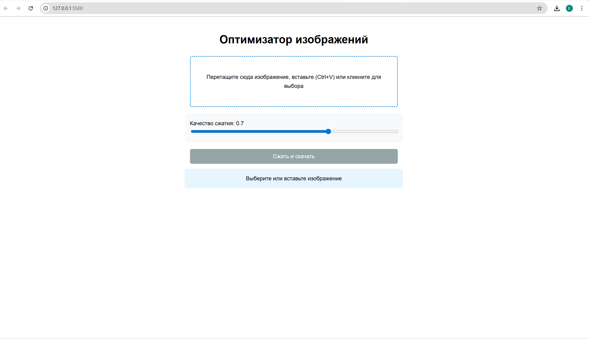
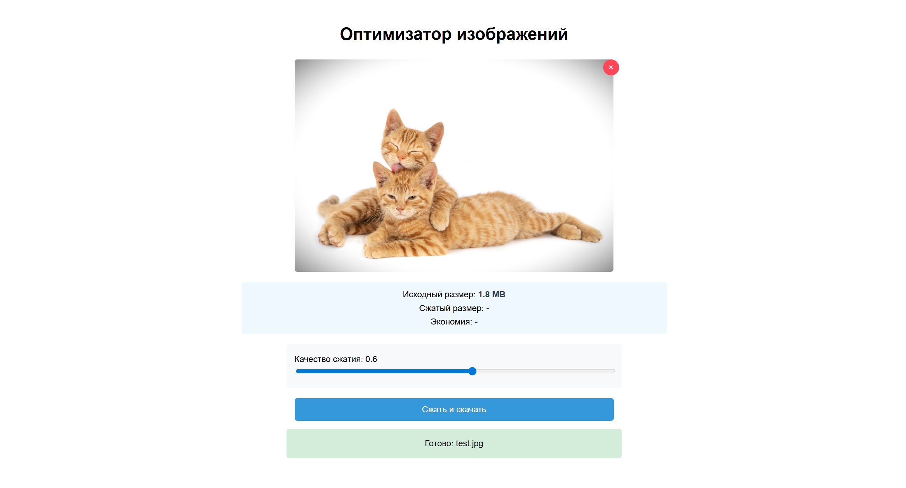

# Image Compressor - Оптимизатор изображений 🖼

Веб-приложение для сжатия изображений прямо в браузере.
Уменьшает размер JPEG/PNG.

*Разработан в рамках учебного проекта в МИИГАиК.*

## 🌟 Возможности
- 📤 Загрузка изображений через:
  - Перетаскивание файла
  - Выбор файла из проводника
  - Вставку из буфера обмена (Ctrl+V)
- 🎚 Настройка уровня сжатия (0.1–1.0)
- 📈 Показ статистики:
  - Исходный и сжатый размер
  - Процент экономии места
- ⏬ Скачивание результата

## 🖼 Скриншоты интерфейса

### Основное окно
  

### Настройки сжатия
 

### Результат обработки
  
## ⚙️ Технологии
- HTML5
- CSS3
- JavaScript(ES6)
- Библиотека Compressor.js для сжатия

## 🚀 Как запустить

### Вариант 1: Через Live Server
1. Установите расширение "Live Server" в VS Code
2. Откройте проект в VS Code
3. Запустите через правую кнопку мыши на index.html → "Open with Live Server"

### Вариант 2: Через http-server
1. Установите [Node.js](https://nodejs.org/)
2. Установите http-server:
   ```bash
   npm install --save-dev http-server
3. Запустите проект:
   ```bash
   npm start
4. Откройте в браузере:
   ```bash
   http://localhost:5500 
### Вариант 3: Прямое открытие в браузере
1. Откройте index.html через проводник в браузере

## 🚀 Как использовать после запуска
1. Загрузите изображение любым способом
2. Отрегулируйте качество сжатия ползунком
3. Нажмите "Сжать и скачать"

## 📝 Лицензия

Этот проект создан в учебных целях. Использование кода разрешено для обучения и некоммерческого использования.

*Учебный проект © 2025 | [МИИГАиК]*
